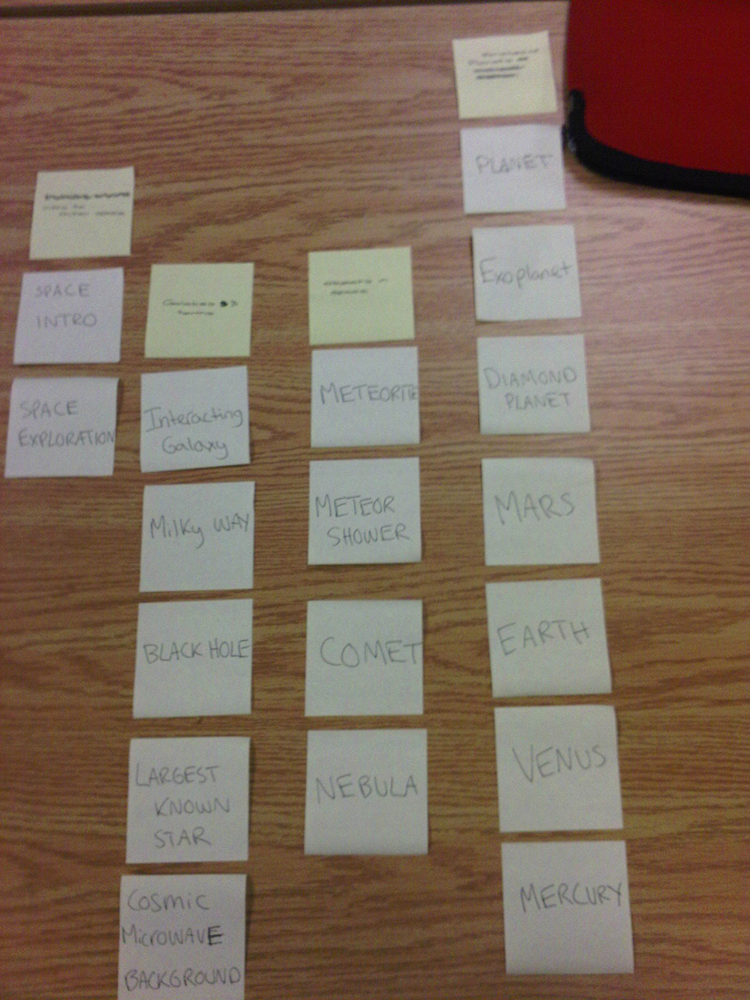
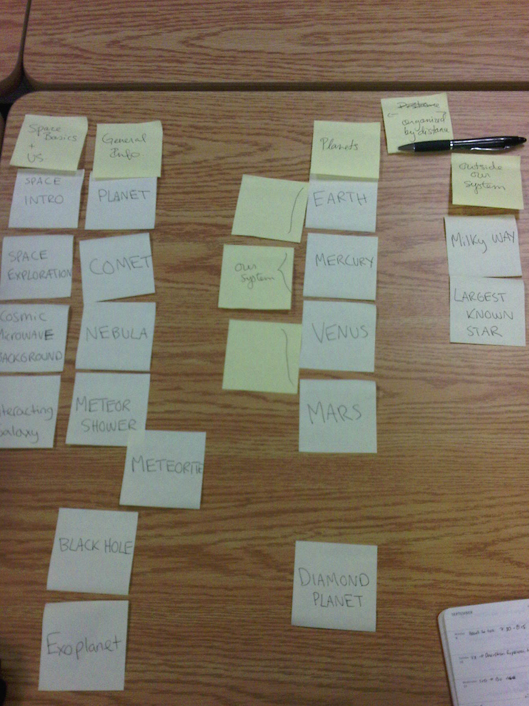

# Card sort report

The purpose of this card sort was to determine common navigation patterns and categories from the content of space.

## Specifics

The card sort was conducted by Caroline Guindon on September 12, 2013, between the times of 5:00 PM and 6:00 PM with the following participants:

- Jessica Haye
- Alyson Mahoney

### Cards

18 cards were used covering a broad range of applicable content for the website. The following topics were used as cards:

1. Space Intro
2. Space Explorations
3. Interacting Galaxy
4. Planets
5. Milky Way
6. Black Hole
7. Largest Known Star
8. Cosmic Microwave Background
9. Meteorite
10. Meteor Shower
11. Comet
12. Nebula
13. Diamond Planet
14. Mars
15. Earth
16. Mercury
17. Venus
18. Exoplanet

## Card sort results

*Card sort 1 by Jessica Hay*

*Card sort 2 by Alyson Mahoney*

## Observations

- Did the participants have any common comments?
	- 	Wanted to know what some of the more complicated terms meant (exoplanet, cosmic microwave Background, interacting galaxy)
- Did they have questions that stood out?
	- no
- Did they struggle with certain articles or topics?
	- Space exploration
- Did they find common groupings? Or were the groupings completely different?
	- Both had a group for planets and a general/basics categorie
- Were some of the groupings completely unexpected?
	- One participant categorized the terms by distance from us in space
- Were the results similar to your expectations?
	- Yes, I expected the planet group and have the space objects to be in the same group
- How did you feel while watching them perform the task?
	- Curious, about there thought process